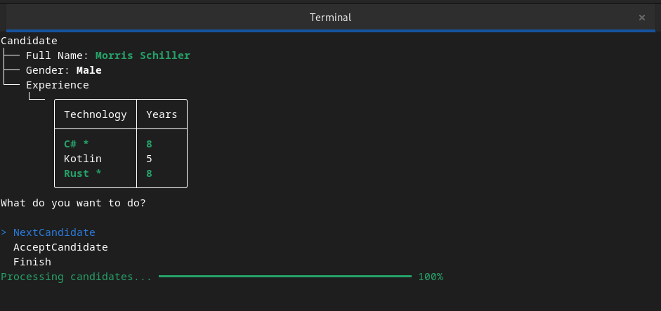

# global-recruitment

## Architecture Overview

```
Solution
│
├── GlobalRecruitment.Console/
│
│
└── GlobalRecruitment.Test/
```

## Technologies

- **.NET 8.0**: The services are built with .NET 8.0.

- **Spectre.Console**: 
    - Spectre.Console is a .NET library that makes it easier to create beautiful console applications. It provides a variety of features such as tables, progress bars, and markdown rendering.

## Requirements

- [.NET 8.0 SDK or later](https://dotnet.microsoft.com/en-us/download/dotnet/8.0)


## Running the tests

The project doesn't have much test, only one test has been written to test the `MatchService` in the project and make sure that the `serialization` and `deserialization` works fine with the sample data.

```bash
dotnet test
```

## Running the application

To run the application, navigate to the `GlobalRecruitment.Console` directory and run the following command:

```bash
dotnet run
```

## Setting the required Technologies

in the first window, you will be asked to enter the technologies that you want the candidates to have:


- you can scroll up and down using the `arrow keys`.
- you can select the technologies by pressing the `space key`.
- you can press the `enter` key to confirm your selection.

## Setting the required Experience for each technology


- you can enter the required experience for each technology by entering a number and pressing `Enter`.

## Selecting the candidates



- The information about each candidate will be shown, the related technologies to your selection will be highlighted in green.

- you can select one of the options:
    - `NextCandidate`: reject current one and display the next.
    - `AcceptCandidate`: add this candidate to the accepteds and display the next one.
    - `Finish`: finish the candidate selecting and display the accepted candidates.


### Loading more candidates

if the list of current API candidates is finished, you will be asked if you want to load more candidates from the API.


## Displaying the accepted candidates


## Notes

- The application is designed to be able to load more candidates from the API if the current list is finished.

- The 3-4 hour time to do the task was not enough to implement all the requirements, so I focused on the main requirements and the main functionalities.

- The UI/UX of the application is not the best, but it's functional and easy to use.